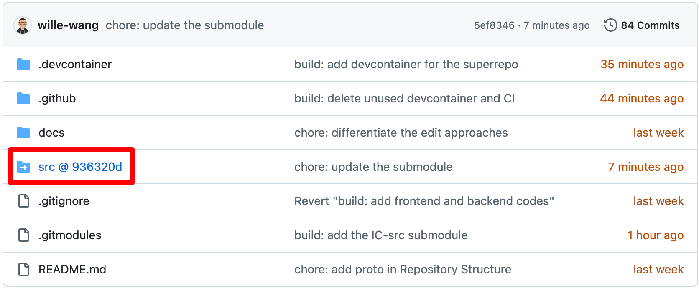
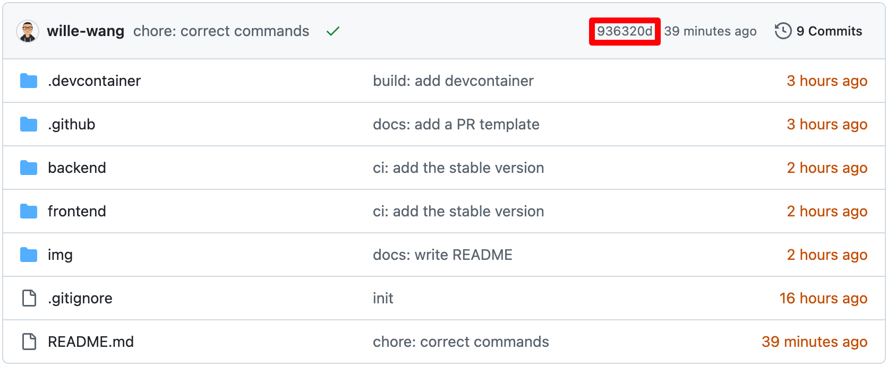

# IC-src

This shared repository contains the source code of the iConcepts application, collaboratively maintained by IC-BlueRing and IC-RedBack teams.

URL: <https://iconcepts.vercel.app/>

<!-- TOC start (generated with https://github.com/derlin/bitdowntoc) -->

- [IC-src](#ic-src)
  - [Main Technologies](#main-technologies)
  - [Directory Structure](#directory-structure)
  - [Usage](#usage)
    - [For End Users](#for-end-users)
    - [For Developers](#for-developers)
  - [Requirements](#requirements)
    - [Prettier](#prettier)
    - [Git Large File Storage](#git-large-file-storage)
    - [Dependencies](#dependencies)
  - [Testing](#testing)
    - [Online Testing](#online-testing)
    - [Offline Testing](#offline-testing)
  - [Additional Resources](#additional-resources)
  - [Workflow](#workflow)
    - [Shared Repository Initialization](#shared-repository-initialization)
  - [Collaborative Commits and PRs](#collaborative-commits-and-prs)
    - [Committing](#committing)
    - [Branching](#branching)
  - [Contributiors](#contributiors)

<!-- TOC end -->

## Main Technologies

| Area           | Tech Stack                                                                                                 | Description                                                                                                                                | 
|----------------|------------------------------------------------------------------------------------------------------------|--------------------------------------------------------------------------------------------------------------------------------------------|
| Language       | [TypeScript](https://www.typescriptlang.org/), [JavaScript](https://developer.mozilla.org/en-US/docs/Web/JavaScript) | TypeScript is used for type safety and scalability, while JavaScript ensures compatibility and flexibility in front-end development.       |
| Framework      | [React](https://reactjs.org/), [Next.js](https://nextjs.org/)                                              | React provides a component-based UI structure, and Next.js enhances it with server-side rendering, routing, and performance optimisation.  |
| Styling        | [Tailwind CSS](https://tailwindcss.com/), [PostCSS](https://postcss.org/)                                  | Tailwind offers a utility-first CSS approach for rapid UI development, while PostCSS enables advanced CSS transformations and plugins.     |
| Authentication | [Clerk](https://clerk.dev/)                                                                                | The application integrates Clerk for user authentication and management, enhancing security and user experience.                           |
| Deployment     | [Vercel](https://vercel.com/)                                                                              | The source code is hosted on Vercel, providing a fast and scalable web application without the need for a backend.                         |
| Cloud Storage  | [Cloudinary](https://cloudinary.com/)                                                                      | Images and Videos are transferred and stored on a third-party cloud service to improve performance by reducing the amount of data loaded. |


## Directory Structure

```plaintext
.

├── backend/            // backend code
├── frontend/           // frontend code
│   ├── public          // Next.js icons or logos
│   ├── src             // Next.js source code
├── README.md           // frontend configuration
└── .DS_Store

```

## Usage

### For End Users

1. Open <https://iconcepts.vercel.app/>.
2. Register an account or sign-in the account.

### For Developers

1. Install software following [Requirements](#requirements).
2. Activate the frontend in the terminal.

```sh
cd IC-src/frontend
npm run dev
# yarn dev  # alternatives
# pnpm dev
# bun dev
```

3. Visit `http://localhost:3000` in the browser to see the frontend page.

> [!WARNING]
>
> This project uses [LastPass](https://lastpass.com/) for password management. Do not hardcode passwords in the codebase or expose them to external stakeholders. Please contact management staff if you require relevant access.

## Requirements


### Prettier

This extension ensures a consistent style for frontend coding files.

1. Install [Prettier on VS Code](https://marketplace.visualstudio.com/items?itemName=esbenp.prettier-vscode).
2. Use Prettier to format files. You can also configure "Format on Save."

### Git Large File Storage

> [!IMPORTANT]
>
> Please follow the instructions below carefully. Failure to do so may result in issues accessing large media files.

This project uses [Git Large File Storage (LFS)](https://git-lfs.com/) to reference files larger than 100 MB.

1. [Install `git-lfs`](https://github.com/git-lfs/git-lfs#installing): Follow the instructions below to install `git-lfs` for your OS.

```sh
brew install git-lfs   # macOS
choco install git-lfs  # Windows
```

2. **Initialize `git-lfs`**:

```sh
git lfs install
git lfs version  # verify the installation
```

3. (_optional_) **Track large files**: Use the `git lfs track` command to specify which file types `git-lfs` should track.

> [!NOTE]
>
> You can safely skip this step if you don't have new file types to track.

```sh
git lfs track "*.<extension>"
# git lfs track "*.mp4"  # track all `.mp4` files
```

4. (_optional_) **Commit the `.gitattributes` file**:

> [!IMPORTANT]
> This step only needs to be done once by the first person setting up `git-lfs` in the repository. Please delete this step after the initial configuration.

```sh
git add .gitattributes
git commit -m "chore: track large files using Git LFS"
```

5. **Add large files**: Add and commit large files as you do with normal files.

```sh
# only for example
git add <filename.extension>  # `video.mp4`, for example
git commit -m "chore: add a large file"
```

For more information, please visit:

- [Git LFS Official Site](https://git-lfs.com/)
- [Git LFS GitHub repository](https://github.com/git-lfs/git-lfs)

### Dependencies

Install dependencies for JavaScript (Node.js 20.x).

```sh
cd IC-src/frontend
npm install
```

## Additional Resources

- [Learn Next.js](https://nextjs.org/learn)
- [Next.js Documentation](https://nextjs.org/docs)
- [Next.js GitHub Repository](https://github.com/vercel/next.js)
- [Vercel Deployment With GitHub Actions](https://youtu.be/FHVaWZjWec4)

## Workflow

This section introduces a _sharing with hiding_ workflow where two teams collaborate on source code in a shared repository while keeping documentation in their separate repositories. The workflow was defined and is maintained by [@wille-wang](https://github.com/wille-wang).

### Shared Repository Initialization

This section guides you to connect the team's repository to this `IC-src` repository/submodule.

> [!WARNING]
> This section should only be done once in a team's repository.

1. Ensure that your team's repository has the following structure:

```plaintext
.
├── src/  # contains only source code
└── ...
```

2. Back-up `src/`, then remove `src/` from the repository.
3. Execute the following command at the team's repository root:

```sh
git submodule add https://github.com/feit-comp90082/IC-src src
```

4. Check the team's repository. It should have a new following structure:

```plaintext
.
├── src/
├── .gitmodule
└── ...
```

5. Push the changes to the remote repository. You will notice the team's repository on GitHub has a hashed `src/` folder.



## Collaborative Commits and PRs

This project utilizes a shared repository for source code implementation to efficiently and effectively separate the responsibility of documentation and code (i.e., the _sharing with hiding_ workflow).

> [!IMPORTANT]
> Since October 2nd, 2024, we have [streamlined our workflow](./mgtRisk#simplified-workflow) by creating new branches directly from `main` and merging them back into `main`, rather than branching from both `main` and `bluering` and merging in reverse order. As a result, this repository functions more as it served a ten-member team rather than two teams working in the same repository.

1. When a member needs to develop a feature, they create a **feature branch** named `<team-name>-<type>-<specifics>` (e.g., `bluering-feat-pageflip`) from the `main` branch directly.
2. After implementing a feature, the member submits a pull request to merge their commits from the feature branch into the `main` branch (e.g., `main` <- `bluering-feat-pageflip`).
3. The tester (e.g., QA Lead in Bluering) implements the tests corresponding to the new feature on the feature branch.
4. The final reviewer (e.g., GitOps Practioner in Bluering) reviews all the commits and decides whether or not to approve the merge.


N.B.: At the end of the sprint, each team must use the following commands in their team's repository (e.g., `IC-Bluering`). Please ensure the latest commit hash in `IC-src` is identical to that of the team's repository (e.g., `IC-Bluering`).

```sh
# pull changes from the IC-src submodule
cd src
git checkout main
git pull

# commit the submodule changes
cd ..  # back to the repo root
git add src
git commit -m "chore: update the submodule"
git push
```




### Committing

This repository intends to use [Conventional Commits](https://www.conventionalcommits.org/en/), which was adapted from the [Angular Commit Style](https://github.com/angular/angular/blob/22b96b9/CONTRIBUTING.md#commit-message-format).

### Branching

- **main branch** (`main`): stable deliverable
- **feature branch** (`TTT-feat-xxx`): implementation of one new feature
- **bugfix Branches** (`TTT-fix-xxx`): bug fixes
- **release Branches** (`release-xxx`): for production release

> [!TIP]
> You can also use the type tags following the [commit convention](#committing).

## Contributiors

Product Owner : Po-Yun Hsiao (Harold) 
Scrum Master : Sangmoon Han 
Quality Assurance Lead :  Man-Hua Chu (Kate)
Development Environment Lead / Deployment Lead : Soyeon Park
Architecture Lead : Yu-Tse Ling (Zona) 
